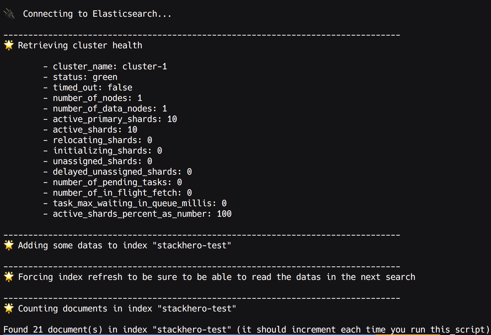

# Elasticsearch getting started

## How to send data from Node.js to Elasticsearch

You can find here some examples of Node.js code to send data to an Elasticsearch server.

These examples are designed to run with a Stackhero for Elasticsearch.
You'll more informations about Stackhero here:
- [Elasticsearch cloud](https://www.stackhero.io/en/services/Elasticsearch/benefits)
- [Elasticsearch pricing](https://www.stackhero.io/en/services/Elasticsearch/pricing)
- [Elasticsearch documentations](https://www.stackhero.io/en/services/Elasticsearch/documentations)

## How to use

- First, clone this repository: `git clone https://github.com/stackhero-io/elasticsearchGettingStarted.git && cd elasticsearchGettingStarted`
- Then, install nodes packages: `npm install`
- Copy the file `.env-example` to `.env` and fill it with your credentials
- Finally, start the first example: `node gettingStarted.js`

We use the official Elasticsearch Node.js client in this example.
You will find all the informations about this client here: https://github.com/elastic/elasticsearch-js

